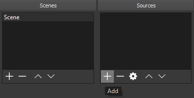
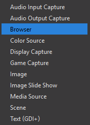
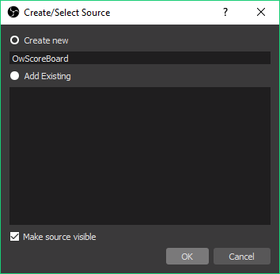
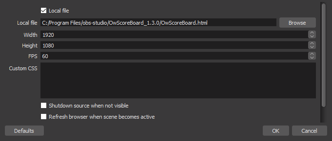
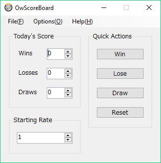

# OwScoreBoard Documentation

## About

OwScoreBoard is an overlay for use with OBS that displays the starting rating and win-loss record for live Overwatch™ streams.  This is a purely cosmetic overlay and does not collect or report any gameplay statistics.
Match results are manually updated via a button press in the controller panel, or configurable hotkey.  A customizable win-loss animation screen is displayed following a match result update.

## Disclaimer and Legal

See License:

- https://github.com/HIJIKIsw/OwScoreBoard/blob/master/LICENSE

Overwatch is a trademark of Blizzard Entertainment, Inc., in the U.S. and/or other countries.

## Releases

Latest releases can be obtained from the following link:

- https://github.com/HIJIKIsw/OwScoreBoard/releases

## Installation

Download latest release and extract archive to any folder on local drive.

## OBS Configuration

Before using OwScoreBoard, it must be configured with your choice of OBS (Open Broadcasting Software).  The following instructions are valid for OBS Studio, so your mileage may vary with another OBS.

1. Create a new Browser source in OBS by clicking on the + button under the Sources box and then select **Browser**.

	

	

2. From the next dialog, select **Create new** and name it OwScoreBoard and click **OK**.

	

3. Enter the following values for the source Properties and then click **OK**:

	- Click **Local file** check box
	- Click on **Browse** and point to location of **OwScoreBoard.html**
	- Set **Width** and **Height** values to desired stream dimensions
	- Set **FPS** to 60
	- Set **Custom CSS** to blank
	
	

The overlay should now display in your stream!

## Usage

After configuring OwScoreBoard with OBS, execute **OwScoreBoardController.exe**.  This will bring up the controller panel.

There are three sections:

### Today's Score

Displays the current win-loss record.  These values will be updated automatically by the buttons in Quick Action, however, they may be changed at any time which will then be reflected in the overlay.

### Starting Rate

Displays the Skill Rating at the beginning of the stream.  This is set manually and will not change.

### Quick Actions

Press Win, Lose or Draw buttons after a match to increment the corresponding counter to update Today's Score.  If enabled, the win-loss animation screen will be displayed after a button press.  Pressing Reset will set all win-loss record values to zero after confirming a prompt but the Starting Rate value will remain.

## Options and Settings

### Always on Top
When enabled, this option will keep the controller panel on top of other windows.

### Suspend Updates
When enabled, this option will disable any updates to the overlay.

### Settings
This will bring up a tabbed panel which allows customization of the win-loss animation screen and hotkeys.

## General Settings

### Win-Loss Animation Settings

- **Enable Win-Loss Animation** can be unchecked to disable animation
- **Name** allows entry of desired streamer name in animation
- **Image** allows for selection of custom image in animation  
  **Note**:  Depending on image dimensions, it may be scaled or cropped
- **Primary Color** sets the primary color in animation
- **Secondary Color** sets the secondary color in animation
- **Font Color** sets the font color in animation
- **Volume** sets the sound effect volume in animation  
  **Note**:  Set the volume to 0 to disable

### Scoreboard Settings

- **Size** sets the amount of scaling for the overlay from 0 to 200%
- **Location** sets the overlay on the top or bottom of the stream

## Hotkey Settings

- Set a key combination for each of the Win, Lose or Draw hotkeys
- Click **Clear** to remove hotkey bindings